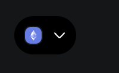
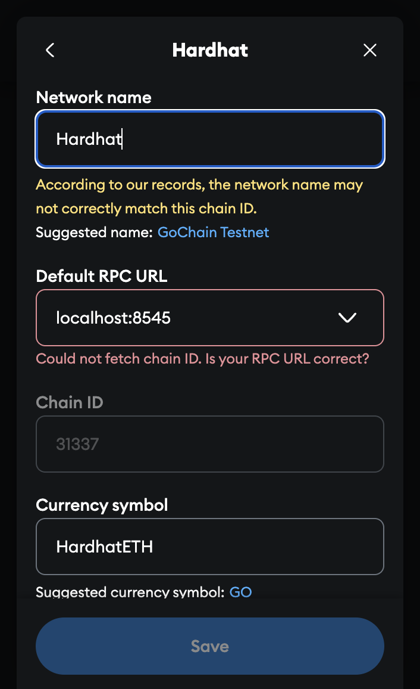
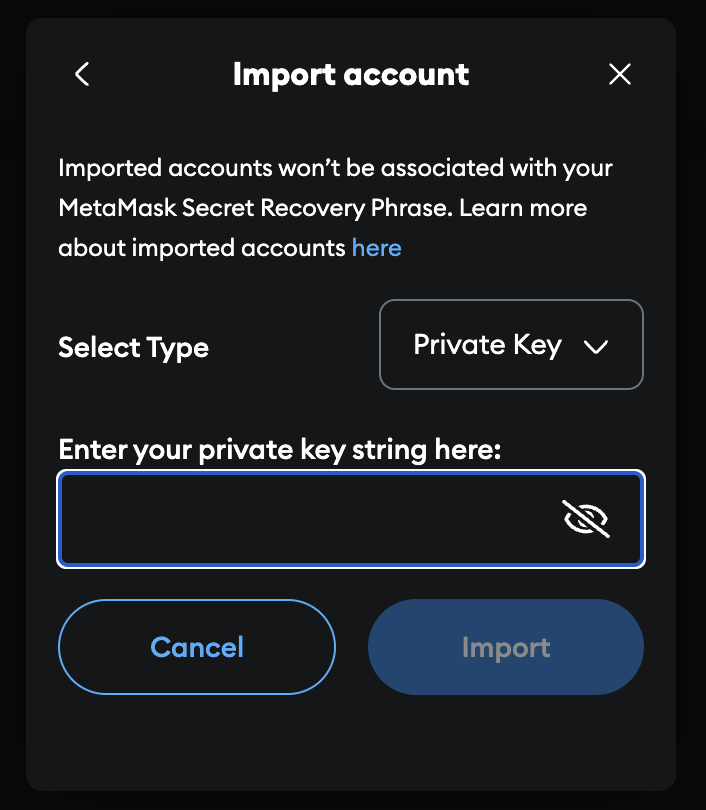

# IS4302 Group 5:  Authentix

## Steps to run Solidity tests:

1. `npm install` (Installs the node_modules folder (dependencies) for the Solidity + Hardhat environment.)

2. `npx hardhat node` (Launches a local Ethereum blockchain powered by Hardhat on `http://127.0.0.1:8545`.)

3. Open a new terminal window and continue.

4. `npx hardhat compile` (Compiles all the Solidity smart contracts in the `contracts/` folder.)

5. `npx hardhat run scripts/deploy.js --network localhost` (Deploys the contracts to the local Hardhat blockchain, we need to run this for the frontend demo to work)

6. `npx hardhat test` (Runs all the test files inside `IS4302Project/test/`.)

7. All of the sections after this are just for the frontend demo, which is focused on showcasing the QR code feature. You can still use all of the key features just from the Solidity smart contracts.

## 🦊 Steps to Set Up MetaMask for the Demo

1. **Open MetaMask** in your browser extension.

2. **Add Hardat as a Custom Network**  
   Click on the top left Ethereum icon → **Add a custom network**

   

3. **Fill in the following fields:**

   | Field             | Value                          |
   |------------------|--------------------------------|
   | Network Name      | Hardhat             |
   | RPC URL       | http://127.0.0.1:8545    or localhost:8545      |
   | Chain ID          | `31337`         |
   | Currency Symbol   | HardhatETH                            |
   | Block Explorer URL| *Leave blank*                  |

   
 
4. **Click "Save"**  
   You should now see “Hardhat” as an option in your MetaMask networks.

5. **Import a Test Account**  
   Go to MetaMask → Add account or hardware wallet → Import account -> Paste in the private key from the 3rd account shown in the Hardhat node logs (from when u ran npx hardhat node)

   

## Steps to run the demo: 

1. `npx hardhat node` (This starts a local Ethereum blockchain using Hardhat. It runs on http://localhost:8545)

### Setting up Express.js + MongoDB backend

2. Open another new terminal window

3. Ensure that MongoDB is running on your system at the default address (mongodb://localhost:27017).

4. `cd backend` 

5. `npm install` (Installs all backend dependencies)

6. `npm run server` (Starts the Express.js + MongoDB backend)

### Setting up React + Vite frontend

7. Open another new terminal window

8. `npm run prepareFrontend` (This is a custom script defined in IS4302Project/package.json)
   This command runs these 3 commands:
   `npx hardhat compile` (Compiles the Solidity contracts)
   `node scripts/copyABIs.js` (Copies the contract ABIs into the frontend.)
   `npx hardhat run scripts/deploy.js --network localhost` (Deploys all contracts to the local Hardhat blockchain & sets them up for the demo)

10. `cd frontend`

11. `npm install` (Installs all frontend dependencies)

12. `npm run dev` (Starts the React + Vite frontend)

13. `http://localhost:5173/` (Open your browser and navigate to this url)
